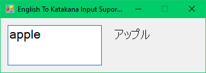

# English To Katakana Input Supporter

Support: Windows OS
Requirement: .NET Framework

This is a simple, basic program that supports inputting Japanese (Katakana) for those who know English words.

Open the program, keep it running, and continue your work.
When typing, press Ctrl + K to activate the program. Enter an English word to view the result, then press Enter to proceed or press Esc to cancel.

This program will download the newest dictionary every time it starts up, allowing you to contribute to the dictionary for everyone who uses this program, so please don't hesitate to make a pull request :)

※ This program can also be used for shortcut definitions of long words or sentences.